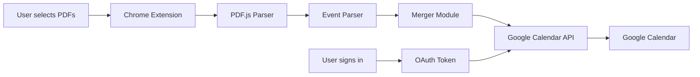
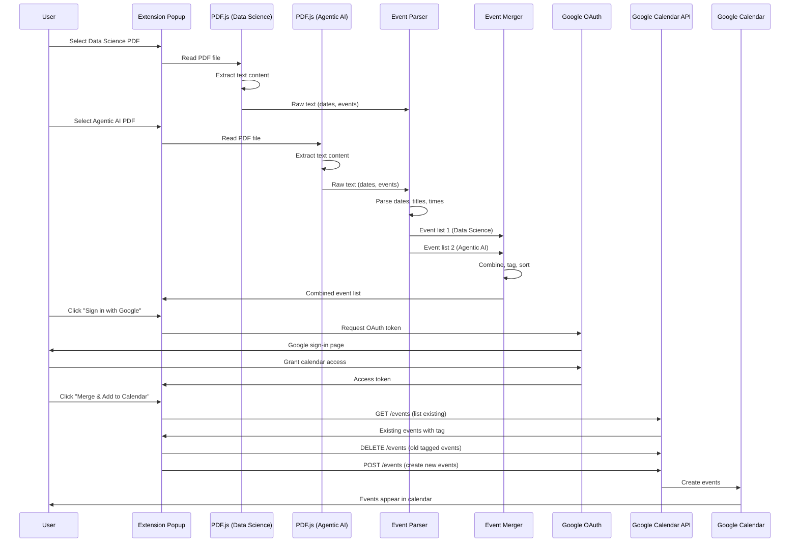

# PDF to Google Calendar Extension - Architecture

## High-Level Architecture: LLM → Chrome Extension → Tool → Google Calendar

```
┌─────────────────────────────────────────────────────────────────────────┐
│                           HIGH-LEVEL FLOW                                │
└─────────────────────────────────────────────────────────────────────────┘

    ┌──────────────┐
    │     LLM      │  (AI Assistant / Cursor / Development)
    │              │  - Designs architecture
    │              │  - Generates code
    │              │  - Provides reasoning
    └──────┬───────┘
           │
           │ (Code generation & guidance)
           │
    ┌──────▼──────────────────────────────────────────────────────────┐
    │                    CHROME EXTENSION                             │
    │  ┌──────────────────────────────────────────────────────────┐  │
    │  │  User Interface (popup.html/popup.js)                     │  │
    │  │  - File pickers for PDFs                                  │  │
    │  │  - Google Sign-in button                                   │  │
    │  │  - Merge & Add to Calendar button                          │  │
    │  └──────────────────────────────────────────────────────────┘  │
    │                                                                  │
    │  ┌──────────────────────────────────────────────────────────┐  │
    │  │  PDF Processing (PDF.js)                                  │  │
    │  │  - Extract text from Data Science PDF                      │  │
    │  │  - Extract text from Agentic AI PDF                      │  │
    │  └──────────────────────────────────────────────────────────┘  │
    │                                                                  │
    │  ┌──────────────────────────────────────────────────────────┐  │
    │  │  Event Parser                                             │  │
    │  │  - Parse dates, titles, times from text                   │  │
    │  │  - Structure as event objects                              │  │
    │  └──────────────────────────────────────────────────────────┘  │
    │                                                                  │
    │  ┌──────────────────────────────────────────────────────────┐  │
    │  │  Merger Module                                            │  │
    │  │  - Combine Data Science + Agentic AI events               │  │
    │  │  - Tag with source                                        │  │
    │  │  - Sort chronologically                                   │  │
    │  └──────────────────────────────────────────────────────────┘  │
    └──────┬──────────────────────────────────────────────────────────┘
           │
           │ (Structured event data)
           │
    ┌──────▼──────────────────────────────────────────────────────────┐
    │                         TOOL                                    │
    │  ┌──────────────────────────────────────────────────────────┐  │
    │  │  Google Calendar API Client                               │  │
    │  │  - OAuth authentication (chrome.identity)                 │  │
    │  │  - List existing events                                   │  │
    │  │  - Delete old tagged events                               │  │
    │  │  - Create new events                                       │  │
    │  │  - Update calendar                                        │  │
    │  └──────────────────────────────────────────────────────────┘  │
    └──────┬──────────────────────────────────────────────────────────┘
           │
           │ (API calls with OAuth token)
           │
    ┌──────▼──────────────────────────────────────────────────────────┐
    │                    GOOGLE CALENDAR                              │
    │  ┌──────────────────────────────────────────────────────────┐  │
    │  │  "Syllabus - Combined" Calendar                            │  │
    │  │  - Data Science events (tagged)                            │  │
    │  │  - Agentic AI events (tagged)                              │  │
    │  │  - Synced across devices                                   │  │
    │  └──────────────────────────────────────────────────────────┘  │
    └──────────────────────────────────────────────────────────────────┘

┌─────────────────────────────────────────────────────────────────────────┐
│                         CONNECTION FLOW                                 │
└─────────────────────────────────────────────────────────────────────────┘

LLM (Design & Code)
    │
    ├─► Chrome Extension (User Interface + Processing)
    │       │
    │       ├─► PDF.js (Extract text)
    │       ├─► Event Parser (Structure data)
    │       └─► Merger (Combine & tag)
    │
    └─► Tool (Google Calendar API Client)
            │
            ├─► OAuth (Authentication)
            ├─► API Calls (Create/Update events)
            └─► Google Calendar (Final destination)

```

## System Block Diagram (Simplified for GitHub)

### Visual Overview

```
┌─────────────────────────────────────────────────────────────────────┐
│                         USER ACTIONS                                │
│  [Select Data Science PDF]  [Select Agentic AI PDF]                │
│  [Sign in with Google]  [Merge & Add to Calendar]                   │
└─────────────────────────────────────────────────────────────────────┘
                              │
                              ▼
┌─────────────────────────────────────────────────────────────────────┐
│                    CHROME EXTENSION                                 │
│  ┌──────────────────┐  ┌──────────────────┐                      │
│  │  PDF.js Parser 1  │  │  PDF.js Parser 2  │                      │
│  │  (Data Science)  │  │  (Agentic AI)      │                      │
│  └────────┬─────────┘  └────────┬─────────┘                      │
│           │                      │                                 │
│           ▼                      ▼                                 │
│  ┌─────────────────────────────────────┐                          │
│  │      Event Parser                    │                          │
│  │  (Extract dates, titles, times)     │                          │
│  └──────────────┬──────────────────────┘                          │
│                 │                                                   │
│                 ▼                                                   │
│  ┌─────────────────────────────────────┐                          │
│  │      Merger Module                   │                          │
│  │  (Combine, tag, sort events)        │                          │
│  └──────────────┬──────────────────────┘                          │
└─────────────────┼──────────────────────────────────────────────────┘
                  │
                  ▼
┌─────────────────────────────────────────────────────────────────────┐
│                    TOOL: Google Calendar API                        │
│  ┌──────────────────────────────────────────────────────────────┐  │
│  │  OAuth (chrome.identity.getAuthToken)                        │  │
│  └───────────────────────────┬──────────────────────────────────┘  │
│                              │                                       │
│  ┌───────────────────────────▼──────────────────────────────────┐  │
│  │  API Client                                                  │  │
│  │  • List events (GET)                                         │  │
│  │  • Delete old events (DELETE)                               │  │
│  │  • Create new events (POST)                                  │  │
│  └───────────────────────────┬──────────────────────────────────┘  │
└───────────────────────────────┼──────────────────────────────────────┘
                                │
                                ▼
┌─────────────────────────────────────────────────────────────────────┐
│                    GOOGLE CALENDAR                                  │
│  ┌──────────────────────────────────────────────────────────────┐  │
│  │  "Syllabus - Combined" Calendar                               │  │
│  │  • Data Science events                                        │  │
│  │  • Agentic AI events                                          │  │
│  │  • Tagged with [Syllabus Importer]                            │  │
│  └──────────────────────────────────────────────────────────────┘  │
└─────────────────────────────────────────────────────────────────────┘
```

### Mermaid Diagram (Alternative)



## Data Flow Diagram



## Component Breakdown

### 1. Extension Popup (UI Layer)
- **File pickers** for two PDFs
- **Google Sign-in button**
- **Merge & Add to Calendar button**
- **Status messages** (progress, errors)

### 2. PDF Processing Layer
- **PDF.js** library (loaded in extension)
- **Text extraction** from PDF files
- **Output:** Raw text strings

### 3. Event Parser Layer
- **Date detection** (multiple formats)
- **Event title extraction**
- **Time parsing** (if available)
- **Output:** Structured event objects

### 4. Merger Module
- **Combine** two event lists
- **Tag** each event with source (Data Science / Agentic AI)
- **Sort** chronologically
- **Output:** Single merged event list

### 5. Authentication Layer
- **Chrome Identity API** (`chrome.identity.getAuthToken`)
- **Google OAuth** flow
- **Token management** (store, refresh)
- **Output:** Access token for API calls

### 6. Google Calendar API Client
- **List events** (check existing)
- **Create events** (POST)
- **Update events** (PUT)
- **Delete events** (DELETE)
- **Calendar management** (create/find "Syllabus - Combined" calendar)

### 7. Google Calendar (External)
- **User's calendar** (or dedicated "Syllabus - Combined" calendar)
- **Events** with tags/descriptions
- **Sync** across devices

## Key Decisions

1. **Dedicated Calendar:** Create/use a separate calendar "Syllabus - Combined" to keep syllabus events separate from personal events
2. **Tag-based Updates:** Tag all events with `[Syllabus Importer]` so we can find and update only "our" events
3. **Full Refresh:** On "Update," delete all tagged events and recreate from latest PDFs (simpler than diff/merge)
4. **Client-side Only:** PDF parsing happens in the extension (no backend needed)
