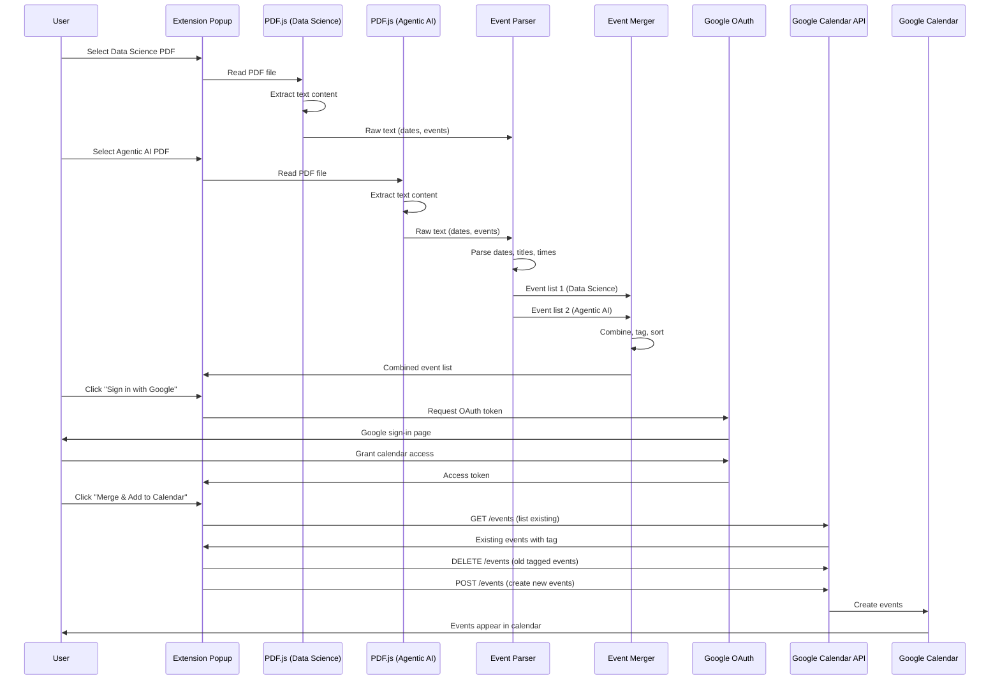

# PDF to Google Calendar Extension - Architecture

## System Block Diagram

```mermaid
graph TB
    subgraph "User Actions"
        U1[User selects<br/>Data Science PDF]
        U2[User selects<br/>Agentic AI PDF]
        U3[User clicks<br/>Sign in with Google]
        U4[User clicks<br/>Merge & Add to Calendar]
    end

    subgraph "Chrome Extension - Frontend"
        UI[Extension Popup UI<br/>popup.html/popup.js]
        FP1[File Picker 1<br/>PDF.js Reader]
        FP2[File Picker 2<br/>PDF.js Reader]
    end

    subgraph "PDF Processing"
        PDF1[PDF.js Parser<br/>Extract text from<br/>Data Science PDF]
        PDF2[PDF.js Parser<br/>Extract text from<br/>Agentic AI PDF]
        EP1[Event Parser 1<br/>Parse dates, titles, times<br/>from Data Science text]
        EP2[Event Parser 2<br/>Parse dates, titles, times<br/>from Agentic AI text]
    end

    subgraph "Event Processing"
        MERGE[Merger Module<br/>Combine both event lists<br/>Tag with source<br/>Sort by date]
        EVENTS[Event List<br/>Array of events:<br/>date, title, time, source]
    end

    subgraph "Google Authentication"
        OAUTH[Chrome Identity API<br/>chrome.identity.getAuthToken]
        GOOGLE_AUTH[Google OAuth<br/>User signs in<br/>Grants calendar access]
        TOKEN[Access Token<br/>Bearer token for API]
    end

    subgraph "Google Calendar API"
        API_CLIENT[API Client<br/>HTTPS requests to<br/>calendar/v3/events]
        LIST_EVENTS[List existing events<br/>in Syllabus calendar<br/>with tag]
        CREATE_EVENT[Create new events<br/>POST /events]
        UPDATE_EVENT[Update existing events<br/>PUT /events/{id}]
        DELETE_EVENTS[Delete old events<br/>DELETE /events/{id}]
    end

    subgraph "Google Calendar"
        CAL[User's Google Calendar<br/>Syllabus - Combined<br/>calendar]
        EVENT1[Event 1<br/>Data Science: Live Class]
        EVENT2[Event 2<br/>Agentic AI: Assignment]
        EVENTN[Event N...]
    end

    %% User flow
    U1 --> FP1
    U2 --> FP2
    FP1 --> PDF1
    FP2 --> PDF2
    PDF1 --> EP1
    PDF2 --> EP2
    EP1 --> MERGE
    EP2 --> MERGE
    MERGE --> EVENTS

    %% Auth flow
    U3 --> OAUTH
    OAUTH --> GOOGLE_AUTH
    GOOGLE_AUTH --> TOKEN

    %% Calendar update flow
    U4 --> API_CLIENT
    TOKEN --> API_CLIENT
    EVENTS --> API_CLIENT
    API_CLIENT --> LIST_EVENTS
    LIST_EVENTS --> DELETE_EVENTS
    DELETE_EVENTS --> CREATE_EVENT
    CREATE_EVENT --> CAL
    UPDATE_EVENT --> CAL

    %% Calendar structure
    CAL --> EVENT1
    CAL --> EVENT2
    CAL --> EVENTN

    style U1 fill:#e1f5ff
    style U2 fill:#e1f5ff
    style U3 fill:#e1f5ff
    style U4 fill:#e1f5ff
    style MERGE fill:#fff4e1
    style EVENTS fill:#fff4e1
    style TOKEN fill:#e8f5e9
    style CAL fill:#f3e5f5
```

## Data Flow Diagram



## Component Breakdown

### 1. Extension Popup (UI Layer)
- **File pickers** for two PDFs
- **Google Sign-in button**
- **Merge & Add to Calendar button**
- **Status messages** (progress, errors)

### 2. PDF Processing Layer
- **PDF.js** library (loaded in extension)
- **Text extraction** from PDF files
- **Output:** Raw text strings

### 3. Event Parser Layer
- **Date detection** (multiple formats)
- **Event title extraction**
- **Time parsing** (if available)
- **Output:** Structured event objects

### 4. Merger Module
- **Combine** two event lists
- **Tag** each event with source (Data Science / Agentic AI)
- **Sort** chronologically
- **Output:** Single merged event list

### 5. Authentication Layer
- **Chrome Identity API** (`chrome.identity.getAuthToken`)
- **Google OAuth** flow
- **Token management** (store, refresh)
- **Output:** Access token for API calls

### 6. Google Calendar API Client
- **List events** (check existing)
- **Create events** (POST)
- **Update events** (PUT)
- **Delete events** (DELETE)
- **Calendar management** (create/find "Syllabus - Combined" calendar)

### 7. Google Calendar (External)
- **User's calendar** (or dedicated "Syllabus - Combined" calendar)
- **Events** with tags/descriptions
- **Sync** across devices

## Key Decisions

1. **Dedicated Calendar:** Create/use a separate calendar "Syllabus - Combined" to keep syllabus events separate from personal events
2. **Tag-based Updates:** Tag all events with `[Syllabus Importer]` so we can find and update only "our" events
3. **Full Refresh:** On "Update," delete all tagged events and recreate from latest PDFs (simpler than diff/merge)
4. **Client-side Only:** PDF parsing happens in the extension (no backend needed)
