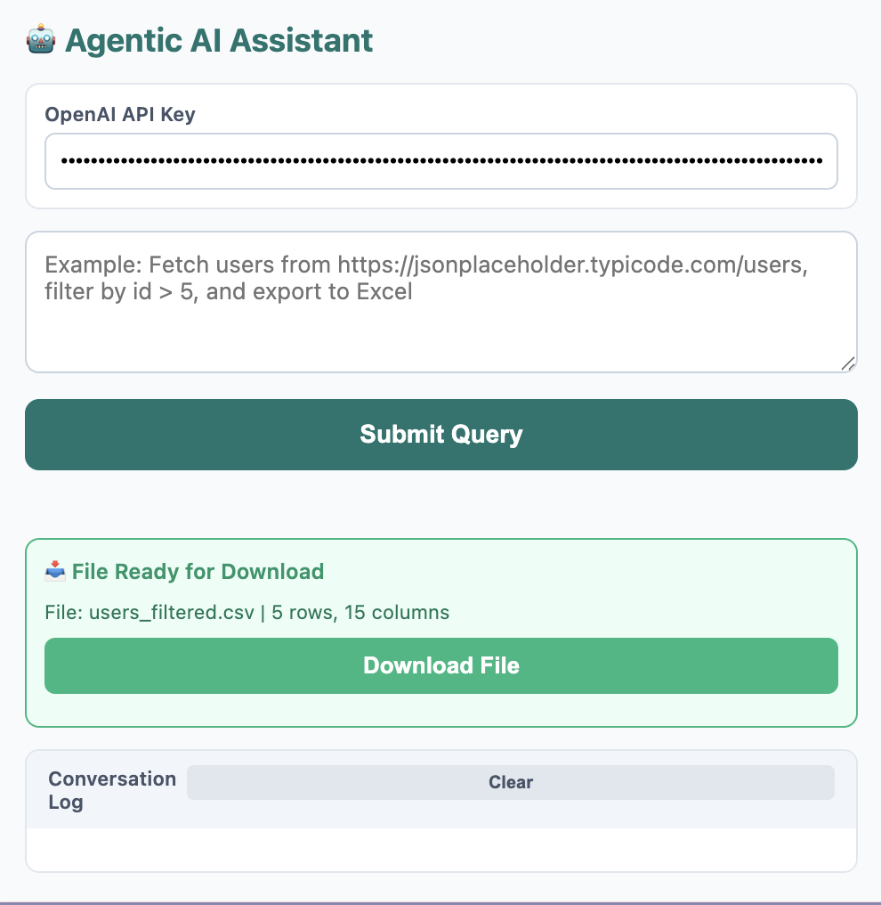

# Agentic AI Chrome Extension

## Extension UI



## Project Overview

This Chrome Extension demonstrates an **Agentic AI** system that uses OpenAI's GPT-4o-mini with function calling to perform complex multi-step tasks. The extension follows the agentic loop pattern:

```
User Query → LLM Response → Tool Call → Tool Result → 
   LLM Response (with context) → Tool Call → Tool Result → 
   LLM Final Response
```

## Problem Statement

**Parse a JSON API response, filter data, and export to Excel**

The extension allows users to:
- Fetch data from **any HTTP/HTTPS endpoint** (public APIs, localhost, internal APIs - any URL)
- Filter the data based on natural language conditions
- Export filtered results to Excel/CSV
- All through conversational interaction with an AI agent

## Features

1. **Multi-step Reasoning**: LLM breaks complex tasks into steps
2. **Context Preservation**: All previous interactions included in each LLM call
3. **Tool Calling**: LLM decides which tools to use and when
4. **Available Tools**:
   - `api_call`: Fetch JSON from **any HTTP/HTTPS endpoint** (works with any URL)
   - `filter_data`: Filter arrays based on conditions
   - `export_excel`: Export data to CSV/Excel (flattens nested objects automatically)
   - `calculator`: Perform mathematical calculations

## Installation

1. Clone or download this repository
2. Open Chrome and go to `chrome://extensions/`
3. Enable "Developer mode" (top right)
4. Click "Load unpacked"
5. Select the extension directory

## Setup

1. Get an OpenAI API key from [OpenAI Platform](https://platform.openai.com/api-keys)
2. Open the extension popup and enter your API key (it will be saved automatically)
3. **Downloads:** Exported CSV is saved to Chrome’s default download folder. Set it in **chrome://settings/downloads** (e.g. to `/Users/satta/Downloads`) if needed.

## Usage

### Example 1: Fetch and Filter Users

```
Fetch users from https://jsonplaceholder.typicode.com/users, 
filter by id > 5, and export to Excel
```

### Example 2: Complex Filtering

```
Get data from https://api.example.com/products, 
filter where price < 100 and category === "electronics", 
then export to products.csv
```

### Example 3: Multi-step Task

```
Calculate the sum of first 10 Fibonacci numbers, 
then fetch users from https://jsonplaceholder.typicode.com/users, 
filter by id matching those Fibonacci numbers, 
and export the result
```

## High-Level Block Diagram: How the API Works

```
┌─────────────────────────────────────────────────────────────────────────────┐
│                              USER (Popup UI)                                 │
│  • Enter OpenAI API key   • Type natural language query   • Click Submit    │
└─────────────────────────────────────────────────────────────────────────────┘
                                        │
                                        ▼
┌─────────────────────────────────────────────────────────────────────────────┐
│                           AGENTIC LOOP (agent.js)                           │
│  Maintains conversation history; runs loop until no more tool calls        │
└─────────────────────────────────────────────────────────────────────────────┘
         │                                    │
         │ 1. Send messages + tools          │ 3. Tool result
         ▼                                    │
┌─────────────────────┐                       │
│   LLM (llm.js)      │  2. Tool call        │
│   OpenAI API        │  (name + params)     │
│   gpt-4o-mini       │─────────────────────►│
│   Function calling  │                       │
└─────────────────────┘                       │
         ▲                                    │
         │ 4. Next LLM call with full context │
         │◄───────────────────────────────────┘
         │
         │ 5. No more tool calls → final text response
         ▼
┌─────────────────────────────────────────────────────────────────────────────┐
│                         TOOLS (tools.js)                                    │
│  ┌──────────────┐  ┌──────────────┐  ┌──────────────┐  ┌──────────────┐   │
│  │  api_call    │  │ filter_data  │  │ export_excel │  │  calculator  │   │
│  │  GET/POST    │  │ condition    │  │ CSV download │  │  expression  │   │
│  │  JSON API    │  │ on array     │  │ + storage    │  │  eval-safe   │   │
│  └──────────────┘  └──────────────┘  └──────────────┘  └──────────────┘   │
│       │ GET responses cached (5 min TTL) by URL                            │
└─────────────────────────────────────────────────────────────────────────────┘
                                        │
                                        ▼
┌─────────────────────────────────────────────────────────────────────────────┐
│  DOWNLOAD: Export data stored in chrome.storage → "Download File" button    │
│  triggers anchor download → file saved to Chrome default download folder   │
└─────────────────────────────────────────────────────────────────────────────┘
```

**Flow in one sentence:** User query → Agent sends history to OpenAI → LLM returns tool call(s) → Extension runs tools (API, filter, export) → Results added to history → Repeat until LLM returns only text → User can download CSV from popup.

## Architecture

See [ARCHITECTURE.md](./ARCHITECTURE.md) for detailed system design and diagrams.

## How It Works

1. **User Query**: User enters a natural language query
2. **LLM Analysis**: OpenAI GPT-4o-mini analyzes the query and identifies needed tools
3. **Tool Execution**: Extension executes tools (API calls, filtering, etc.)
4. **Context Update**: Results are added to conversation history
5. **Next Step**: LLM receives full context and decides next action
6. **Repeat**: Process continues until task is complete
7. **Final Response**: LLM provides summary of completed task

## Conversation Log

The extension maintains a full conversation log showing:
- User queries
- LLM responses
- Tool calls and parameters
- Tool results
- Final outcomes

This log can be copied for submission/analysis.

## Files

- `manifest.json`: Extension configuration
- `popup.html`: UI interface
- `popup.js`: UI logic and event handlers
- `agent.js`: Agentic loop manager
- `llm.js`: OpenAI API client (using GPT-4o-mini model)
- `tools.js`: Tool registry and execution
- `ARCHITECTURE.md`: System design documentation

## Requirements

- Chrome browser (Manifest V3)
- OpenAI API key (get from https://platform.openai.com/api-keys)
- Internet connection (for API calls)

## Limitations

- Maximum 10 iterations per query (prevents infinite loops)
- API calls subject to CORS restrictions
- CSV export format (not true Excel .xlsx)

## Suggested JSON APIs for Testing

Use these in your query (e.g. "Fetch from &lt;url&gt;, filter by ..., export to Excel"):

| API | URL | Sample filter idea |
|-----|-----|--------------------|
| **JSONPlaceholder – Users** | `https://jsonplaceholder.typicode.com/users` | `id > 5` |
| **JSONPlaceholder – Posts** | `https://jsonplaceholder.typicode.com/posts` | `userId === 1` |
| **JSONPlaceholder – Todos** | `https://jsonplaceholder.typicode.com/todos` | `completed === false` |
| **JSONPlaceholder – Comments** | `https://jsonplaceholder.typicode.com/comments` | `postId > 100` |
| **Dog API (breeds list)** | `https://api.thedogapi.com/v1/breeds` | `temperament` contains "Friendly" (if supported) |
| **REST Countries** | `https://restcountries.com/v3.1/all` | `region === "Europe"` (use first 50 or filter in query) |
| **Open Library (search)** | `https://openlibrary.org/search.json?q=javascript` | Limit by `first_publish_year` |
| **Fake Store API** | `https://fakestoreapi.com/products` | `price < 20` or `category === "electronics"` |

**Example queries:**

- *Fetch users from https://jsonplaceholder.typicode.com/users, filter by id > 5, and export to Excel*
- *Get products from https://fakestoreapi.com/products, filter by price < 50, export to products.csv*
- *Fetch todos from https://jsonplaceholder.typicode.com/todos, filter by completed === false, export to pending_todos.csv*

**Note:** The extension can fetch from **any HTTP/HTTPS endpoint** including:
- Public APIs (no CORS restrictions from extension context)
- Localhost servers (`http://localhost:3000/api`)
- Internal/private APIs (if accessible from your browser)
- APIs that normally block CORS (extension context bypasses CORS)

The extension has `host_permissions` for `http://*/*` and `https://*/*` to allow fetching from any URL.

## Future Enhancements

- Support for more tools (email, notifications, file operations)
- True Excel export (.xlsx format)
- Conversation history persistence
- Multiple API key management
- Custom tool definitions
